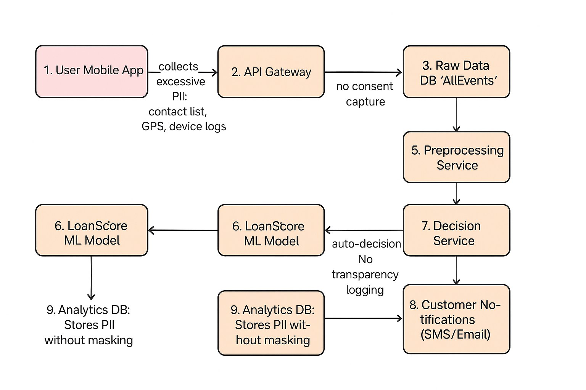
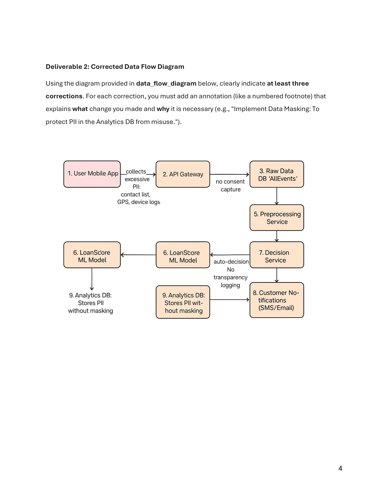

# QuickLoan Mobile — Independent Data Governance Review

*Governance, Quality, and Ethics assessment of an automated micro-lending pipeline*

| Field | Value |
|---|---|
| **Prepared by** | Data Governance Consultant |
| **Client** | QuickLoan Mobile (Accra, Ghana) |
| **Date** | 15 May 2026 |
| **Version** | 1.0 |
| **Classification** | Confidential — Internal Use |

---

## Executive Summary

QuickLoan Mobile's pipeline runs on a fundamental tension: speed of micro-lending growth versus governance discipline. The single most material exposure is fully automated lending without a human-review path, which collides with **Section 41 of Ghana's Data Protection Act, 2012 (Act 843)** — the right of data subjects not to be subject to decisions based solely on automated processing. Compounding risks include excessive collection of contacts, GPS, and device logs (Sections 19, 20), unclassified raw retention in `AllEvents` (Sections 22, 24), unmasked analytics and third-party sharing (Sections 28, 30), and decision delivery without explanation (Sections 17, 23). The review prioritises controls a small Accra-based engineering team can ship within standard sprints.

> *Note: This document is prepared by a Data Engineer / Data Governance specialist, not a lawyer. Where section interpretation is material to a decision, verify with Ghana Data Protection Commission (DPC) guidance or qualified counsel.*

---

## Deliverable 1 — Governance Review Card

*Findings are grounded in the specific pipeline steps drawn on page 4 of the brief and the data items named in the audit triggers (contact list, GPS, device logs, automated loan-decision outcome).*

| Section | Issue / Definition | Impact | Suggested Fix / Mitigation |
|---|---|---|---|
| **1. Data Quality Risk**  *Dimensions: consistency, validity, completeness, uniqueness.* | Raw events flow Step 2 → Step 3 (API Gateway → `AllEvents`) with no schema contract. Phone numbers arrive in mixed formats (local vs. E.164), timestamps mix ISO-8601 and epoch ms, and retried events are duplicated. The downstream LoanScore feature pipeline therefore ingests mis-canonicalised identifiers and ghost duplicates. | Join failures and label leakage in the feature store cause **false declines** for legitimate applicants (who appear as duplicates) and **false approvals** for the same applicant under two identifiers — producing credit losses, customer harm, and **Section 26 (Quality of Information)** exposure. | • Schema contract at Step 2 with Pydantic v2 / Great Expectations. • Canonicalise phone numbers to E.164 and timestamps to ISO-8601 UTC at ingest. • Idempotency-key dedup on every write to `AllEvents`. • Weekly DQ SLO dashboard: completeness ≥99%, validity ≥99.5%, freshness <15 min. |
| **2. Legal & Compliance Risk**  **Data Classification: Sensitive.**  *Combines financial-behavioural data with PII (contacts, GPS, device logs) used to drive an adverse legal/economic decision against the data subject — the highest applicable bar.* | Step 1 collects contacts, GPS, device logs without granular consent (no consent capture at Step 2 → 3) — breaches **Section 19 (minimality)** and **Section 20 (consent)**. Step 7 issues a fully automated adverse decision delivered to Step 8 without explanation — breaches **Section 41 (automated decision-making)**. Indefinite raw retention in `AllEvents` breaches **Section 22 (purpose limitation)** and **Section 24 (retention)**. | DPC sanctions including suspension of registration (renewable biennially); civil liability under Act 843; reputational damage in Ghana's fintech ecosystem; cross-border transfer exposure if any processor sits outside Ghana (**Section 47** territory — flag for legal review). *I am not a lawyer; confirm interpretation with DPC guidance.* | • Granular consent toggles at onboarding — contacts / GPS / marketing / credit-bureau share each independently revocable. • Drop contacts, GPS, device logs from the collection schema. • Documented retention schedule with auto-purge jobs (raw events 90 days; scored features 24 months; decision logs 7 years per BoG record-keeping). • Section-41 compliant human-review path on adverse decisions with a 7-day appeal window. • Verify current DPC registration before next renewal cycle. |
| **3. Bias & Fairness Risk**  *Source of Bias: proxy variables, label bias, feedback-loop bias.* | (i) **Proxy variables** — GPS encodes region (north vs. south Ghana, peri-urban vs. rural) which correlates with ethnicity and income; device model encodes income tier; contact-graph density encodes social class and informal-sector employment. (ii) **Label bias** — historical loan-officer decisions used as training labels embed prior human bias against women and northern applicants. (iii) **Feedback-loop bias** — declined applicants never produce a repayment label, so the model never self-corrects on the rejected tail. | Disparate impact against women, northern applicants, and informal-sector workers; regulatory exposure under Act 843 fairness expectations (Sections 18, 26); structural exclusion of the very segments micro-lending is meant to serve; erosion of public trust. | • Weekly **Disparate Impact Ratio (four-fifths rule)** per protected attribute (region, gender, age band). • Publish a **model card** documenting training data, features, performance, and known limits. • Leave-one-out proxy tests on GPS, device model, contact-graph features; remove any feature whose removal closes a parity gap. • Route low-confidence (predicted PD within ±5pp of cutoff) and fairness-flagged decisions to human review. |
| **4. Storytelling / Reporting Recommendation** | **Metric: Automated Approval Rate Parity by Region and Gender.**  Definition: for each (region × gender) cohort over a rolling 28-day window, `parity = approval_rate(cohort) / approval_rate(reference_cohort)`. Refresh weekly; alert when any cohort's parity falls below 0.80 (four-fifths rule). | **Visualisation: Grouped Bar Chart** — side-by-side bars per cohort with a horizontal reference line at 0.80. A non-technical board reads threshold breaches in seconds; the shape of the metric (many discrete cohorts, single threshold) matches the visual. | **Why it matters:** Operationalises Sections 17, 18, and the fairness expectation behind Section 41 by making algorithmic disparity visible, auditable, and actionable on a defined threshold — rather than rhetorical. |

---

## Deliverable 2 — Corrected Data Flow Diagram

*Below is the diagram reproduced from page 4 of the brief. Annotations are keyed by step number to the corresponding node. Eight annotations are provided (the brief requires three) to cover all six flaw classes named in the audit and to add two extras that close residual gaps.*

*Figure 1. QuickLoan Mobile data flow (source: brief, page 4).*

*Full-page render for reference:*

*Figure 2. Page 4 of the source brief, full render.*

### Annotation Table

| # | Diagram Location | Correction | Why (Principle / Act 843 section) |
|---|---|---|---|
| **1** | **Step 1 — User Mobile App** | Remove collection of contact list, GPS, and device logs. Restrict the schema to loan-relevant fields only (identity, income proxy, opt-in bank/MoMo history, repayment history). | **Section 19 (minimality)**, **Section 18 (specification of purpose)**. Eliminates surveillance-grade data being repurposed for credit scoring. |
| **2** | **Step 2 → Step 3 — API Gateway** | Insert an explicit Consent Capture & Schema Validation gate. Each PII category behind an independent, revocable toggle; payloads validated against a published Pydantic schema before persistence; consent receipts logged. | **Section 20 (consent)**, **Section 26 (quality)**. One control point closes both the consent gap and the DQ gap. |
| **3** | **Step 3 — Raw Data DB `AllEvents`** | Replace the undifferentiated dump with classified tables (Public / Internal / Confidential / Sensitive) and a documented retention schedule: raw events 90-day TTL, scored features 24 months, decision logs 7 years. Encrypt at rest with KMS-managed keys. | **Section 22 (purpose limitation)**, **Section 24 (retention)**, **Section 28 (security safeguards)**. |
| **4** | **Step 5 — Preprocessing Service** | Add a defined Data Quality gate (Great Expectations suite for completeness, validity, uniqueness). Records that fail validation flow to a dead-letter queue for investigation; they are not silently dropped or imputed into features. | **Section 26 (quality of information)**. Prevents silent feature drift into LoanScore. |
| **5** | **Step 6 — LoanScore (duplicate node)** | The diagram shows LoanScore twice; consolidate to a single, versioned model artefact in a registry (e.g. MLflow). One source of truth tied to one model card and one decision-log schema. | Governance hygiene. Without a single versioned artefact, model cards and fairness audits cannot be reliably attached to *the* decision actually served to customers. |
| **6** | **Step 7 — Decision Service** | (a) Log every decision with input hash, model version, top feature contributions, score, and outcome. (b) Route low-confidence (±5pp of cutoff) and fairness-flagged decisions to a human reviewer. (c) Provide every applicant a plain-language reason code and a 7-day appeal path. | **Section 41 (automated decision-making)**, **Sections 17 and 23 (transparency)**. Restores the **Section 39** right of access. |
| **7** | **Step 8 — Customer Notifications (SMS/Email)** | Adverse-decision notifications must include the primary reason code and the appeal route (deep link or USSD short-code). | **Section 23 (transparency)**. Makes the Section 41 right exercisable in practice rather than in theory. |
| **8** | **Step 9 — Analytics DB and 3rd-Party Partner** | Mask and tokenise PII before it lands in analytics: deterministic tokenisation for internal joins, pseudonymisation for any shareable extract. Execute a Data Processing Agreement with every third party and minimise the share schema to the smallest field set the partner can justify. | **Section 28 (security safeguards)**, **Section 30 (processor obligations)**, **Section 47 (cross-border transfer)** if any processor sits outside Ghana — flag for legal review. |

---

## Deliverable 3 — Summary of Review Process

The review traced QuickLoan's pipeline through the canonical data-lifecycle stages — collect, process, store, use, share, retain, destroy — and asked at every step which classification the data carried and whether the controls in place matched that class. The lens surfaced concrete failures rather than abstract concerns. At collect (Step 1), contacts, GPS, and device logs failed the Section 19 minimality test the moment they were named: a credit decision does not require them. At process and store (Steps 2–3), the absence of consent capture and the undifferentiated `AllEvents` dump were observable — no schema, no classification, no retention policy, indefinite by default. At use (Step 7), the automated decision without logging or human review collided with Section 41. At share (Steps 9–10), unmasked PII reaching analytics and a third party breached Sections 28 and 30. Treating every dataset as Sensitive forced controls to be designed against the highest applicable bar.

The proposed metric — Automated Approval Rate Parity by Region and Gender, monitored against the four-fifths rule on rolling 28-day windows — operationalises ethical and transparent governance. It is computable from data the company already holds, it does not require collecting additional protected attributes beyond what consented onboarding supplies, and a grouped-bar visualisation with a 0.80 reference line is legible to a non-technical board. Disparity becomes a chart with a defined action threshold, not a feeling.

Strict governance can choke a fast-scaling fintech, and the controls proposed are deliberately proportionate: schema validation, consent toggles, retention TTLs, decision logging, and a weekly fairness chart are each ticketable within a normal sprint. They do not require new platforms or vendor lock-in; they require discipline at well-defined gates.

*[Word count: 276 words — within the 200–300 range.]*

---

## Appendix A — Act 843 Sections Referenced

*Section numbers below are cited as used in this review. The reviewer is not a lawyer; confirm with Ghana DPC guidance or qualified counsel before relying on any specific section in a regulatory submission.*

- **Section 17** — Application of data protection principles: accountability and lawful, fair processing (transparency anchor).
- **Section 18** — Specification of purpose for which personal data is collected.
- **Section 19** — Minimality: data collected must be adequate, relevant, and not excessive.
- **Section 20** — Consent: lawful basis derived from the data subject's consent or another lawful ground.
- **Section 22** — Purpose limitation / further processing must be compatible with the original purpose.
- **Section 23** — Data subject participation and transparency rights (notification of processing).
- **Section 24** — Retention: personal data must not be kept longer than necessary.
- **Section 26** — Quality of information held by the data controller (accuracy and completeness).
- **Section 28** — Security measures and safeguards over personal data.
- **Section 30** — Data processor obligations (contractual and technical safeguards).
- **Section 31** — Notification of security compromise / breach notification to the DPC.
- **Section 37** — Conditions for lawful processing.
- **Section 39** — Data subject right of access and correction.
- **Section 41** — Right not to be subject to a decision based solely on automated processing.
- **Section 47** — Cross-border transfer of personal data (cited cautiously; for legal review).

---

## Appendix B — Glossary

- **Disparate Impact Ratio (four-fifths rule)** — `approval_rate(group) / approval_rate(reference_group)`. A cohort whose ratio falls below 0.80 is treated as evidence of adverse impact and triggers review. Cohort-level only; never a per-applicant adjustment.
- **Data Classification levels** — *Public* (no harm if disclosed); *Internal* (operational data, low harm); *Confidential* (material harm if disclosed — commercial, contractual); *Sensitive* (financial, health, or behavioural PII whose disclosure causes individual harm — the QuickLoan dataset is Sensitive).
- **Data Lifecycle** — Collect → Process → Store → Use → Share → Retain → Destroy. Each stage has its own controls; a single gap at any stage invalidates upstream effort.
- **Model Card** — A short structured document describing a model's intended use, training data, features, performance by subgroup, known limitations, and operational owner. Versioned alongside the model artefact and reviewed when retraining.

---

*Confidential — Internal Use   |   QuickLoan Mobile — Data Governance Review   |   v1.0*
